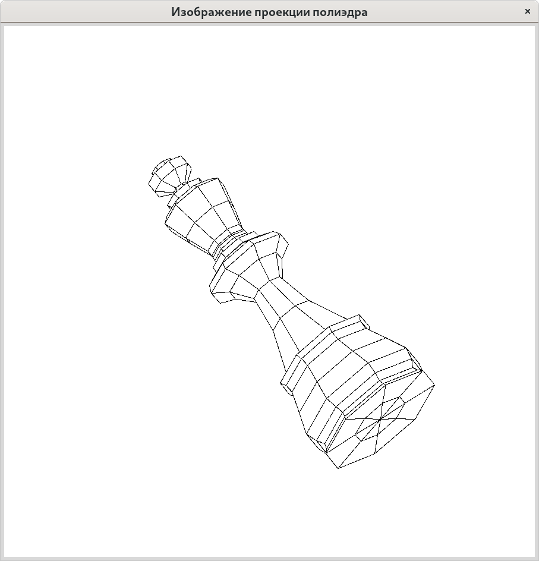

# Изображение проекции полиэдра

82. Назовём точку в пространстве «хорошей», если её проекция находится строго вне квадрата единичной площади с центром в начале координат и сторонами, параллельными координатным осям. Модифицируйте эталонный проект таким образом, чтобы определялась и печаталась следующая характеристика полиэдра: сумма площадей проекций граней, не более двух вершин которых являются «хорошими» точками.

## Проверка соблюдения соглашений о стиле программного кода

~~~{.sh}
find . -name '*.py' -exec pycodestyle {} \;
~~~

## Проверка покрытия тестами кода программы

~~~{.sh}
python -B -m coverage run -m unittest discover tests && coverage report -m ; rm -f .coverage
~~~
